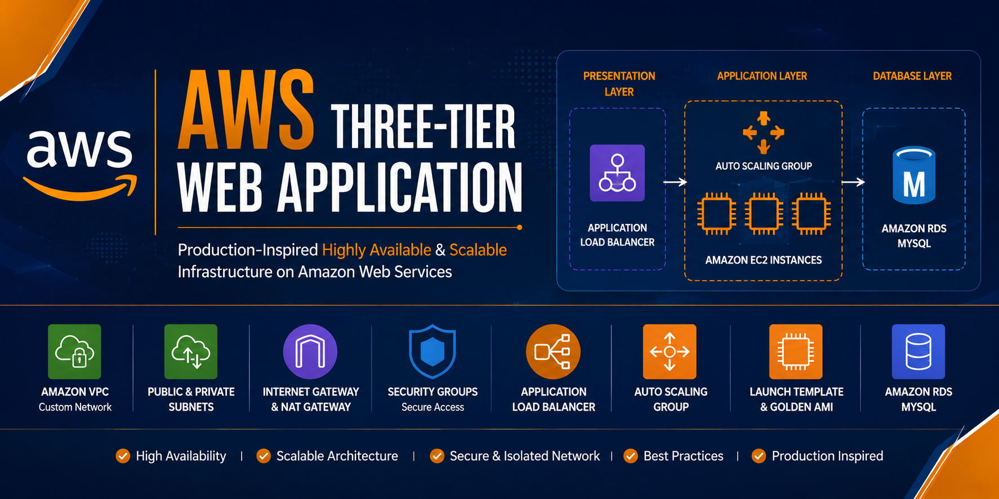

<div align="center">

# 🚀 AWS Three-Tier Web Application on Amazon Web Services (AWS)

### Production-Inspired Cloud Infrastructure using Amazon VPC, EC2, Application Load Balancer, Auto Scaling, Launch Templates, and Amazon RDS MySQL

<p align="center">
  
</p>

<h1 align="center">AWS Three-Tier Web Application</h1>

<p align="center">
Production-Inspired Highly Available & Scalable Infrastructure on AWS
</p>

<p align="center">


</p>

</div>

---

# 📖 Project Overview

This project demonstrates the deployment of a **highly available**, **scalable**, and **secure Three-Tier Web Application** on **Amazon Web Services (AWS)**.

The application follows a production-inspired cloud architecture by separating the infrastructure into three independent layers:

- 🌐 Presentation Layer
- ⚙️ Application Layer
- 🗄️ Database Layer

The infrastructure is designed using AWS networking best practices, allowing the application to remain secure, fault tolerant, and highly available across multiple Availability Zones.

Instead of deploying all resources inside a single network, the application is hosted inside a **custom Amazon VPC** consisting of public and private subnets. Internet-facing components remain isolated from backend resources, while the database is securely deployed inside private database subnets.

To improve reliability and scalability, the application is deployed behind an **Application Load Balancer (ALB)** and powered by an **Auto Scaling Group**, ensuring that traffic is automatically distributed across multiple EC2 instances and new instances can be launched whenever required.

The backend database is hosted on **Amazon RDS MySQL**, allowing secure communication between the application servers and the database without exposing the database directly to the internet.

This project demonstrates practical implementation of cloud architecture principles such as:

- High Availability
- Scalability
- Fault Tolerance
- Secure Networking
- Infrastructure Isolation
- Load Balancing
- Auto Scaling
- Database Security

---

# 🎯 Project Objectives

The primary objectives of this project are:

- Design and deploy a production-inspired Three-Tier Architecture on AWS.
- Create a secure network using Amazon VPC.
- Configure Public and Private Subnets.
- Deploy application servers using Amazon EC2.
- Configure an Application Load Balancer for traffic distribution.
- Implement Auto Scaling for improved availability.
- Deploy Amazon RDS MySQL inside private database subnets.
- Secure communication using Security Groups.
- Follow AWS architectural best practices for scalability and reliability.

---

# ⭐ Key Highlights

- Production-Inspired AWS Architecture
- Multi-AZ Deployment
- Custom Amazon VPC
- Public & Private Subnets
- Internet Gateway
- NAT Gateway
- Route Tables
- Security Groups
- Amazon EC2
- Golden AMI
- Launch Template
- Application Load Balancer
- Auto Scaling Group
- Amazon RDS MySQL
- Highly Available Infrastructure
- Scalable Deployment
- Secure Database Layer

---

# 🚀 Deployment Workflow

The deployment of this project was completed in multiple phases, following AWS best practices to ensure security, scalability, and high availability.

---

## Phase 1 – Network Infrastructure

The first step was to build a secure networking environment.

Tasks performed:

- Created a custom Amazon VPC.
- Configured two Public Subnets.
- Configured two Private Application Subnets.
- Configured two Private Database Subnets.
- Attached an Internet Gateway (IGW).
- Created a NAT Gateway for outbound internet access.
- Configured Route Tables and associated them with the appropriate subnets.

**Outcome:**
A secure and isolated network architecture capable of hosting a production-style application.

---

## Phase 2 – Security Configuration

Security was implemented using dedicated Security Groups.

Configured Security Groups for:

- Application Load Balancer
- EC2 Application Servers
- Amazon RDS Database

Only the required ports were allowed between resources, following the **Principle of Least Privilege**.

---

## Phase 3 – Database Deployment

The database layer was deployed using **Amazon RDS MySQL**.

Tasks performed:

- Created a DB Subnet Group.
- Launched an Amazon RDS MySQL instance.
- Configured database security.
- Connected the application servers to the database.

The database remained isolated inside private database subnets and was not directly accessible from the internet.

---

## Phase 4 – Application Deployment

The application was deployed on an EC2 Builder instance.

Tasks performed:

- Configured the application environment.
- Deployed the frontend and backend application.
- Verified application functionality.
- Created a Golden Amazon Machine Image (AMI) after successful testing.

The AMI was later used for launching identical EC2 instances through Auto Scaling.

---

## Phase 5 – High Availability Setup

To improve reliability and scalability:

- Created a Launch Template.
- Created an Auto Scaling Group.
- Configured the desired capacity.
- Configured an Application Load Balancer.
- Attached the Target Group.
- Verified successful health checks.

This ensured that incoming traffic was distributed evenly across healthy EC2 instances.

---

## Phase 6 – Final Validation

The deployment was validated by:

- Accessing the application through the ALB DNS endpoint.
- Verifying successful communication with Amazon RDS.
- Confirming Target Group health status.
- Testing application accessibility.

The project was successfully deployed and operated as expected.

---


# 📂 Repository Structure

```text
aws-three-tier-web-app/
│
├── README.md
├── LICENSE
├── .gitignore
├── banner/
│   └── banner.png
├── architecture/
│   ├── aws-three-tier-architecture.png
├── application/
├── screenshots/
│   ├── networking/
│   ├── security/
│   ├── database/
│   ├── compute/
│   ├── load-balancer/
│   └── output/
└── docs/
    └── AWS-Three-Tier-Web-Application.pdf
```

---

# 📊 Infrastructure Summary

| Category | Details |
|----------|---------|
| Cloud Provider | Amazon Web Services (AWS) |
| Architecture | Three-Tier Architecture |
| Compute | Amazon EC2 |
| Networking | Amazon VPC |
| Load Balancing | Application Load Balancer |
| Scaling | Auto Scaling Group |
| Database | Amazon RDS MySQL |
| Availability | Multi-AZ Design |
| Security | Security Groups + Private Subnets |

---

# 📸 Project Screenshots

The screenshots are organized by infrastructure components.

## 🌐 Networking
- `networking/01-vpc.jpg`
- `networking/02-subnets.jpg`
- `networking/03-internet-gateway.jpg`
- `networking/04-nat-gateway.jpg`
- `networking/05-route-table-public.jpg`
- `networking/06-route-table-private-app.jpg`
- `networking/07-route-table-private-db.jpg`

## 🔒 Security
- `security/08-security-group-alb.jpg`
- `security/09-security-group-ec2.jpg`
- `security/10-security-group-rds.jpg`

## 🗄 Database
- `database/11-rds-instance.jpg`
- `database/12-db-subnet-group.jpg`

## ⚙ Compute
- `compute/13-builder-ec2.jpg`
- `compute/14-golden-ami.jpg`
- `compute/15-launch-template.jpg`
- `compute/16-auto-scaling-group.jpg`
- `compute/19-ec2-instances.jpg`

## ⚖ Load Balancer
- `load-balancer/17-application-load-balancer.jpg`
- `load-balancer/18-target-group.jpg`

## ✅ Final Output
- `output/20-final-application.jpg`

# ⚠ Challenges Faced

During the deployment of this project, I encountered several practical AWS challenges that helped strengthen my understanding of cloud infrastructure.

### Network Configuration

- Configuring public and private subnets correctly.
- Managing Route Table associations.
- Configuring NAT Gateway routing.

### Security

- Configuring Security Groups using least privilege.
- Restricting direct access to EC2 instances.
- Securing Amazon RDS inside private subnets.

### Compute

- Creating a reusable Golden AMI.
- Building a Launch Template.
- Configuring Auto Scaling correctly.

### Load Balancing

- Registering EC2 instances with the Target Group.
- Resolving health check failures.
- Testing Application Load Balancer routing.

---

# 📚 Key Learnings

This project significantly improved my practical understanding of AWS cloud infrastructure.

### AWS Services

- Amazon VPC
- Amazon EC2
- Amazon RDS
- Application Load Balancer
- Auto Scaling
- Launch Templates

### Networking

- VPC Design
- Public & Private Subnets
- Internet Gateway
- NAT Gateway
- Route Tables
- Security Groups

### Cloud Architecture

- Three-Tier Architecture
- High Availability
- Scalability
- Fault Tolerance
- Infrastructure Isolation

### Deployment

- Application Deployment
- AMI Creation
- Load Balancing
- Infrastructure Validation

---

# 🚀 Future Improvements

The infrastructure can be enhanced further by implementing:

- Infrastructure as Code using Terraform
- AWS CloudFormation
- CI/CD using GitHub Actions
- Amazon CloudWatch Monitoring
- AWS WAF
- AWS Secrets Manager
- HTTPS using AWS Certificate Manager
- Custom Domain using Amazon Route 53

---

# 👨‍💻 Author

## Kushagra Sharma

AWS Cloud | DevOps Enthusiast

### Connect with Me

- GitHub: https://github.com/KushagraSharma22

---

# 📄 License

This project is licensed under the MIT License.

See the **LICENSE** file for more details.

---

<div align="center">

### ⭐ If you found this project helpful, please consider giving it a Star.

Thank you for visiting this repository.

</div>